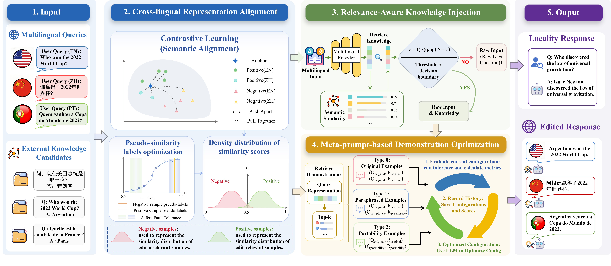

# TRACE: Relevance-Aware Multilingual Knowledge Editing for LLMs



## Overview

TRACE (mulTilingual Representation Alignment and Conditional knowledge Editing) is a relevance-aware framework for multilingual knowledge editing in large language models (LLMs). It addresses two main limitations in existing in-context knowledge editing (IKE) approaches:

1. **Cross-lingual Semantic Gap** – semantically equivalent queries in different languages are mapped to distant regions by multilingual encoders, reducing cross-lingual generalization.
2. **Unconditional Knowledge Injection** – existing methods inject retrieved knowledge regardless of relevance, introducing noise and degrading locality.

TRACE overcomes these challenges via:

- **Cross-lingual Representation Alignment** – aligns multilingual embeddings using contrastive learning with calibrated pseudo-similarity labels.
- **Relevance-Aware Knowledge Injection** – conditionally injects external knowledge based on semantic relevance.
- **Meta-Prompt-Based Demonstration Optimization (RMP)** – iteratively refines few-shot demonstration composition and ordering for better knowledge utilization.

Experiments on Bi-ZsRE and MzSRE show significant improvements in reliability, locality, generality, and portability compared with prior methods.

## Features

- Conditional in-context knowledge editing for multilingual queries.
- Optimized few-shot demonstrations via recursive meta-prompting.
- Cross-lingual semantic alignment using calibrated contrastive learning.
- Supports bilingual and multilingual benchmarks with flexible backbones (e.g., LLaMA2, Baichuan2, Qwen2).
- Open-source training and evaluation scripts included.

## Installation

```bash
# Clone repository
git clone https://github.com/lin-wang-ynu/MKD.git
cd TRACE

# Create Conda environment from trace.yml
desired_env_name="trace_env"
conda env create -f trace.yml -n $desired_env_name
conda activate $desired_env_name
```

> **Note:** CUDA is required for model inference and training.

## Data

- **Bi-ZsRE**: bilingual English–Chinese benchmark.
- **MzSRE**: multilingual dataset covering 12 languages.
- Preprocessed datasets and generated contrastive training data are included in `data/`.

## Usage

### 1. Train Cross-Lingual Similarity Classifier

```bash
python train_classifier.py
```

- Uses `MultilingualDataGenerator` for generating training data for all language combinations.

### 2. Configure Few-Shot Demonstrations

- MIKE orders can be initialized automatically or customized.  
- Recursive Meta-Prompting (RMP) iteratively optimizes demonstration composition and ordering.

### 3. Run TRACE Knowledge Editing

- Outputs stored in `results/` directory.


## Related Models

| Model | Description | Link |
|-------|-------------|------|
| **LLaMA2** | Meta's open-source large language model (7B/13B/70B) | [Hugging Face](https://huggingface.co/models?search=Llama-2) |
| **Baichuan2** | Open-source multilingual LLM by Baichuan AI | [GitHub](https://github.com/baichuan-inc/Baichuan2) / [Hugging Face](https://huggingface.co/baichuan-inc/Baichuan2-13B-Base) |
| **Qwen2** | Alibaba Qwen multilingual large language model | [Hugging Face](https://huggingface.co/Qwen) |

## File Structure

```
TRACE/
├─ data/                   # Benchmark datasets & generated training data
├─ results/                # Evaluation outputs
├─ trace/
    ├─ trace_main.py           # Main script for TRACE inference
    ├─ train_classifier.py     # Cross-lingual similarity classifier training
    ├─ optimize_order_rmp.py   # RMP optimization for demonstration order
├─ README.md               # Project documentation
```


## License

This project is released under the MIT License.

